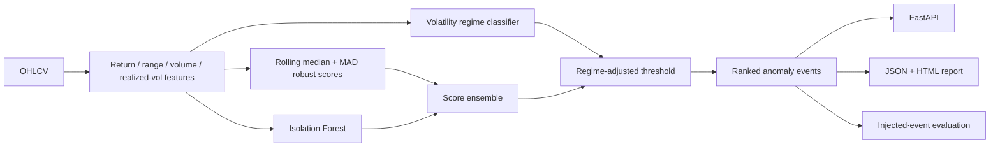

# Market Anomaly Detection

A finance-focused anomaly detection project that combines **robust rolling statistics, multivariate Isolation Forest scores and volatility-regime-aware thresholds** over OHLCV data.

The public baseline uses deterministic synthetic market data with injected shock events so the complete pipeline can be tested without proprietary feeds or live-market dependencies.

## Pipeline



## Implemented signals

- one-period returns and absolute returns;
- rolling realized volatility;
- volume percentage changes;
- intraday high-low range normalized by close;
- rolling **median/MAD robust z-scores** for return and volume anomalies;
- **Isolation Forest** on multivariate market features;
- percentile-normalized score fusion;
- low / normal / high volatility regime classification;
- regime-sensitive anomaly thresholds;
- reason codes explaining which signal contributed to an event.

## Why regime awareness matters

A fixed threshold can over-alert during naturally volatile periods and under-alert during unusually quiet ones. The reference implementation adjusts the ensemble threshold based on a rolling volatility regime. It is intentionally simple and inspectable rather than presented as a production trading signal.

## Synthetic evaluation

`src/synthetic.py` creates correlated OHLCV behavior with changing volatility and injects several large return/volume events. Those construction labels let the project calculate tolerant event-level precision, recall and F1 without pretending that financial anomaly labels are normally available in clean form.

The evaluation matches a detected flag to an injected event within a configurable time tolerance, which is usually more meaningful for event detection than demanding an exact timestamp match.

## Quick start

```bash
python -m venv .venv
source .venv/bin/activate  # Windows: .venv\Scripts\activate
pip install -r requirements.txt
python -m src.cli --rows 900 --seed 42
```

Outputs:

```text
artifacts/anomalies.json
artifacts/anomalies.html
```

For custom data:

```bash
python -m src.cli --input market.csv
```

Expected columns:

```text
timestamp, open, high, low, close, volume
```

## API

```bash
uvicorn app.api:app --reload
curl http://localhost:8000/demo
```

`POST /analyze` accepts an OHLCV series and returns ranked anomaly events with severity, regime and reason codes.

## Docker

```bash
docker build -t market-anomaly-detection .
docker run --rm -p 8000:8000 market-anomaly-detection
```

## Tests / CI

```bash
ruff check .
pytest -q
```

GitHub Actions tests the detectors, runs a synthetic benchmark and builds the API image.

## Model-risk boundary

This repository is an engineering/research demonstration. An anomaly score means *unusual relative to the modeled history/features*, not fraudulent, mispriced or actionable. Market regimes, structural breaks and changing liquidity can all change the meaning of an outlier.

## Portfolio signal

**Python · Pandas · scikit-learn · Isolation Forest · robust statistics · time series · anomaly detection · regime analysis · FastAPI · Docker · CI/CD**
